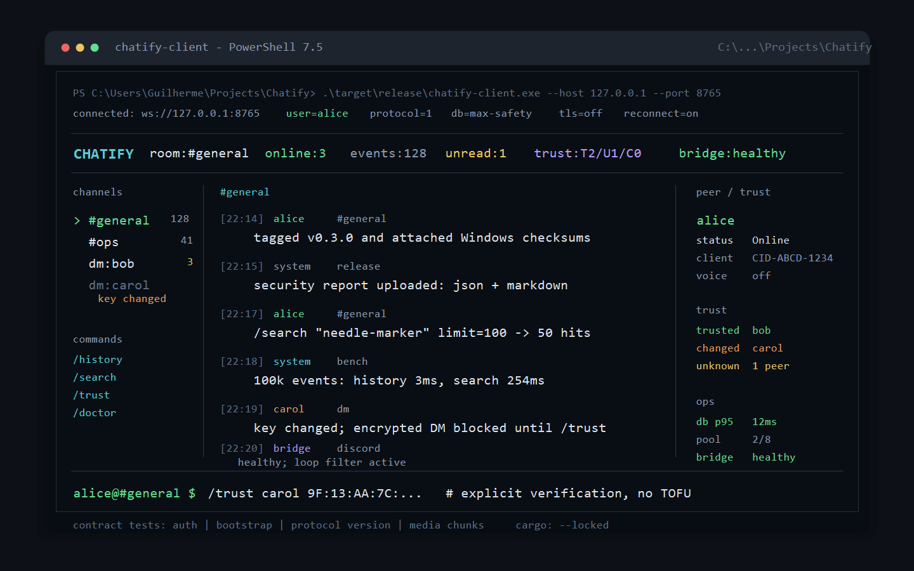

# Chatify

[](https://github.com/kill74/Chatify/actions/workflows/ci.yml)
[](https://github.com/kill74/Chatify/actions/workflows/windows-release-package.yml)
[](https://github.com/kill74/Chatify/releases)
[](LICENSE)

Chatify is a small self-hosted chat app that runs in the terminal.

It includes:

- a Windows-friendly launcher, `chatify.exe`
- a terminal chat client with channels, DMs, replies, reactions, media, voice, and screen-share controls
- a WebSocket server with SQLite history
- an optional Discord bridge for advanced setups



## Easiest Start

### Windows

1. Download `chatify-setup-<version>.exe` from [Releases](https://github.com/kill74/Chatify/releases).
2. Install it.
3. Open **Chatify** from the Start Menu or desktop shortcut.
4. Pick one option:

| Option | Use it when |
| ------ | ----------- |
| `1` Start here | You want to try Chatify on this PC. |
| `2` Host for others | You want people on your local network to join. |
| `3` Join a server | Pick a saved server profile or enter a new IP/host. |
| `4` Server only | This PC should only run the server. |
| `5` Manage servers | Add or remove saved server profiles. |

The launcher stores server data in:

```text
%LOCALAPPDATA%\Chatify
```

First-time usernames can register automatically when using the packaged launcher.
After first setup, pressing Enter in the launcher reconnects with your last mode, host, and port.

### Portable Windows ZIP

1. Download `chatify-windows-x64.zip` from Releases.
2. Extract it.
3. Run:

```text
chatify.exe
```

## Build From Source

Install the Rust stable toolchain, then run:

```bash
cargo build --release
```

Start the server:

```bash
./target/release/chatify-server --host 0.0.0.0 --port 8765 --enable-self-registration
```

Start the client in another terminal:

```bash
./target/release/chatify-client --host 127.0.0.1 --port 8765
```

On Windows, use `.exe`:

```powershell
.\target\release\chatify-server.exe --host 0.0.0.0 --port 8765 --enable-self-registration
.\target\release\chatify-client.exe --host 127.0.0.1 --port 8765
```

## Daily Use

Most common actions are clickable in the terminal UI:

- click a room to switch rooms
- click a person to open a DM
- click `Join call`, `Mute`, `Deafen`, or `Share screen`
- click `Reply` or `React` on messages
- click `Image`, `Video`, or `Audio` to attach media
- press `Ctrl+K` for the action palette
- press `Ctrl+,` or click `Settings` to toggle media, markdown, notifications, sound, reconnect, and animations

Slash commands still work as a fallback. See [docs/COMMANDS.md](docs/COMMANDS.md).

## Main Binaries

| Binary | What it does |
| ------ | ------------ |
| `chatify.exe` | Simple Windows launcher. |
| `chatify-server` | Runs the WebSocket chat server. |
| `chatify-client` | Opens the terminal chat UI. |
| `discord_bot` | Optional Discord bridge, built only with `--features discord-bridge`. |

## Useful Commands

Run the Windows dev scripts:

```powershell
.\run-server.ps1
.\run-client.ps1 -ProgramArgs @('--host','127.0.0.1','--port','8765')
```

Build a Windows package:

```powershell
.\build-windows-package.ps1
```

Build only the ZIP:

```powershell
.\build-windows-package.ps1 -SkipInstaller
```

## Checks

Before committing changes, run:

```bash
cargo check --workspace --bins --locked
cargo fmt --all --check
cargo clippy --workspace --all-targets --all-features --locked -- -D warnings
cargo test --workspace --all-targets --locked
```

Protocol contract checks:

```bash
cargo test --locked --test message_contracts auth_contract_returns_expected_fields
cargo test --locked --test message_contracts compatibility_contract_client_bootstrap_flow_stays_stable
cargo test --locked --test message_contracts protocol_contract_advertises_backward_compatible_version
cargo test --locked --test message_contracts file_contract_relays_media_metadata_and_chunks
```

Feature-gated builds:

```bash
cargo check --features discord-bridge --bin discord_bot --locked
cargo check -p chatify-client --features bridge-client --locked
```

## Security Notes

Chatify is designed for small, controlled deployments.

Important limits:

- no certificate pinning
- session tokens do not survive server restarts
- encrypted search is a linear scan
- single-node server only
- no independent third-party security audit

Read [SECURITY.md](SECURITY.md) and [docs/SECURITY_NOTES.md](docs/SECURITY_NOTES.md) before using it in a serious environment.

## More Docs

- [docs/COMMANDS.md](docs/COMMANDS.md) - click-first UI and slash command fallback
- [docs/DEMO.md](docs/DEMO.md) - local demo walkthrough
- [docs/ARCHITECTURE.md](docs/ARCHITECTURE.md) - system design
- [docs/BENCHMARKS.md](docs/BENCHMARKS.md) - performance notes
- [docs/ENGINEERING_CASE_STUDY.md](docs/ENGINEERING_CASE_STUDY.md) - design tradeoffs
- [docs/RELEASE_CHECKLIST.md](docs/RELEASE_CHECKLIST.md) - release steps
- [CHANGELOG.md](CHANGELOG.md) - release history

## License

MIT. See [LICENSE](LICENSE).
